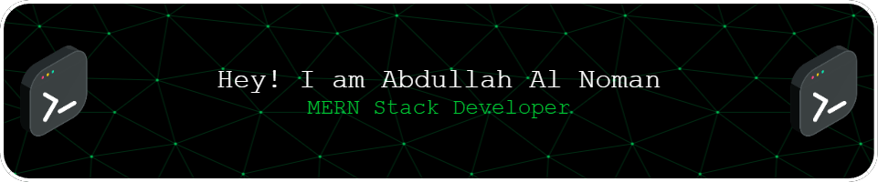

  

<!-- 

  

 -->

<h1 align="center">
  
</h1>

  
  
  

### 🚀 Aspiring Software Engineer | MERN-Stack Developer | Tech Enthusiast

🎓 Software Engineering Student at **Daffodil International University**  
💻 Passionate about **software development**, **web technologies**, and **building impactful products**  
🌱 Continuously improving my engineering skills through projects, practice, and exploration

### 🧠 Developer Mode

- Build clean, responsive frontends with modern frameworks.
- Design backend APIs and data flows for practical, real-world use cases.
- Follow Git/GitHub workflows with iterative improvement and collaboration.
- Focus on readable code, performance, and long-term maintainability.

 

## 🌱 Currently Exploring

- ⚙️ **Frontend:** HTML, CSS, JavaScript, React, Next.js, Tailwind CSS
- 🛠️ **Backend:** Node.js, Express.js, REST APIs
- 🗄️ **Databases:** MongoDB, MySQL
- ☁️ **Cloud & Tools:** Firebase, Google Cloud, Git, GitHub, Linux

## 📫 Reach Me

  

  

<h3 align="center">🤝 Connect With Me</h3>

  
  
  
  <a href="https://www.hackerrank.com/hackerrank_noman" target="_blank">

## 🧰 Tech Stack

  

## 🏆 GitHub Trophies

  

## 📊 GitHub Analytics

  
  

  

  

## ✍️ Dev Quote

  

---

  <b>Thanks for visiting my profile! 🚀</b> 
  I enjoy turning ideas into real products through software and modern technology.

  

